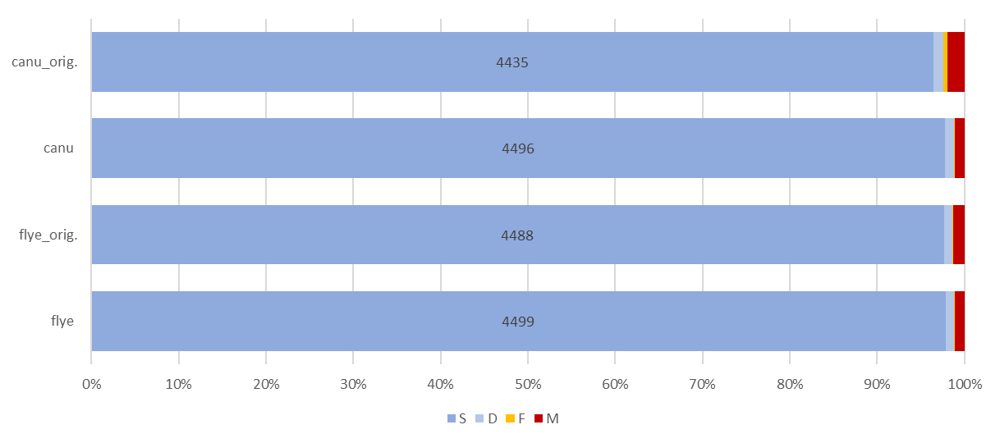
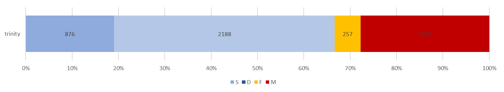
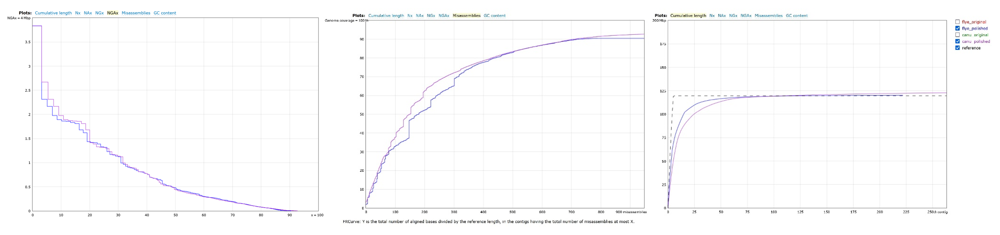
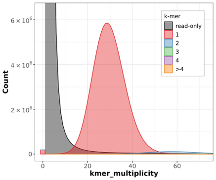
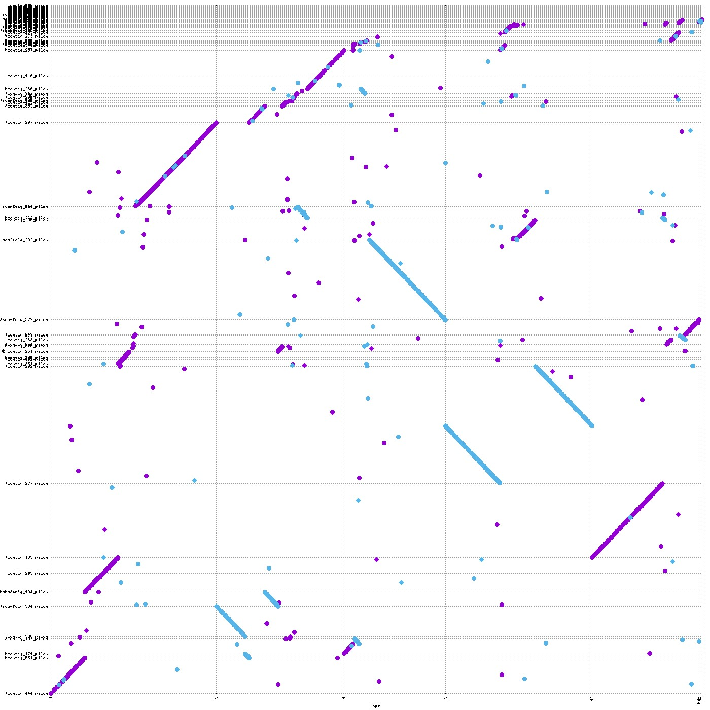
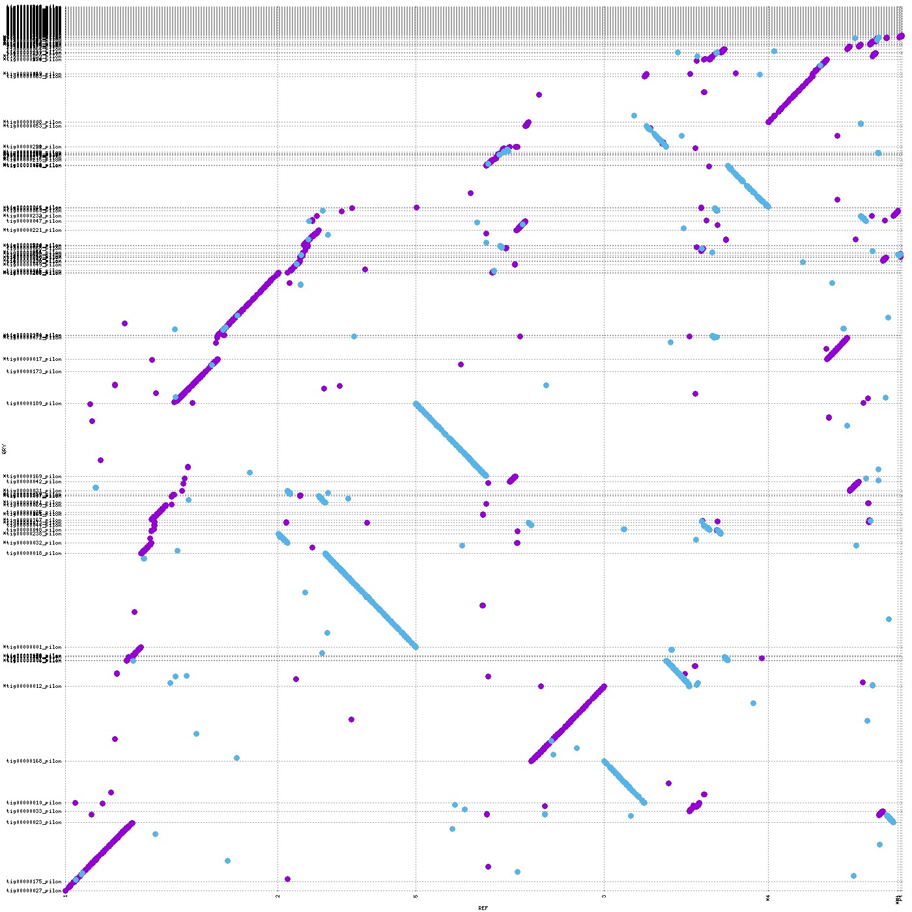
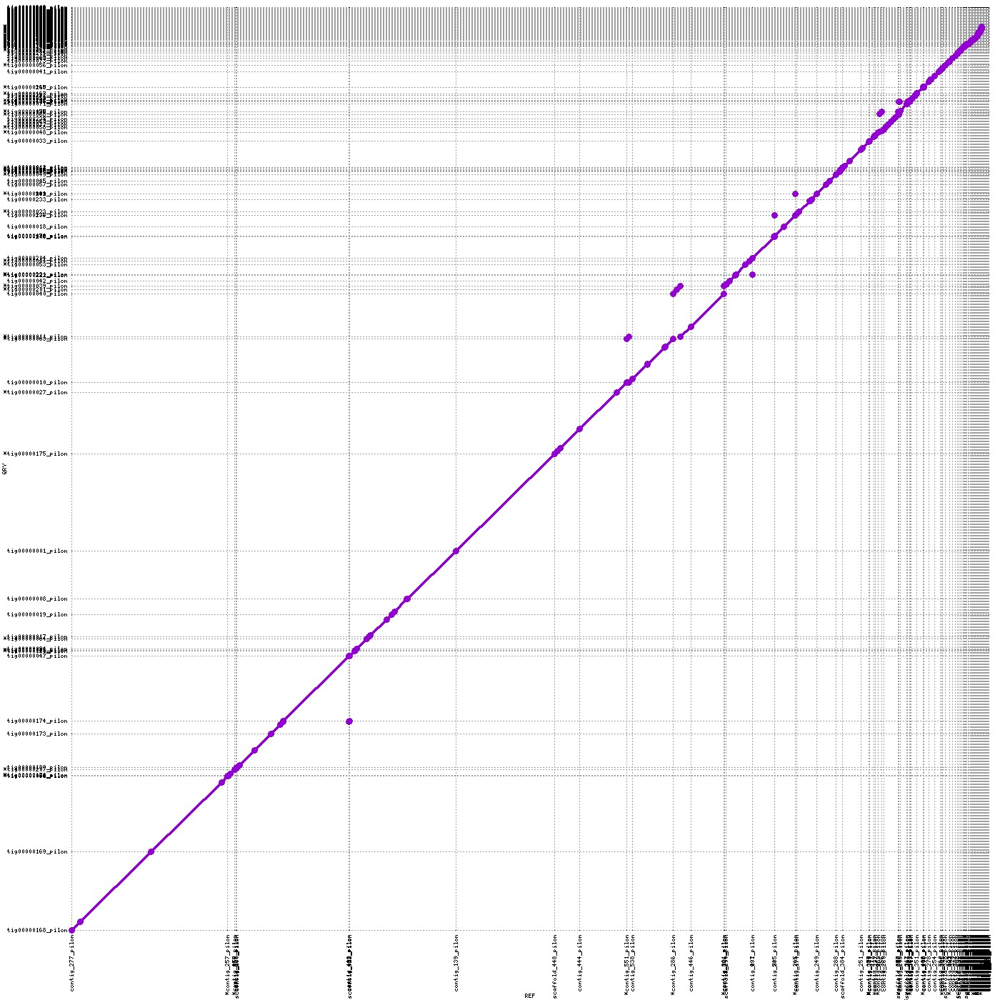
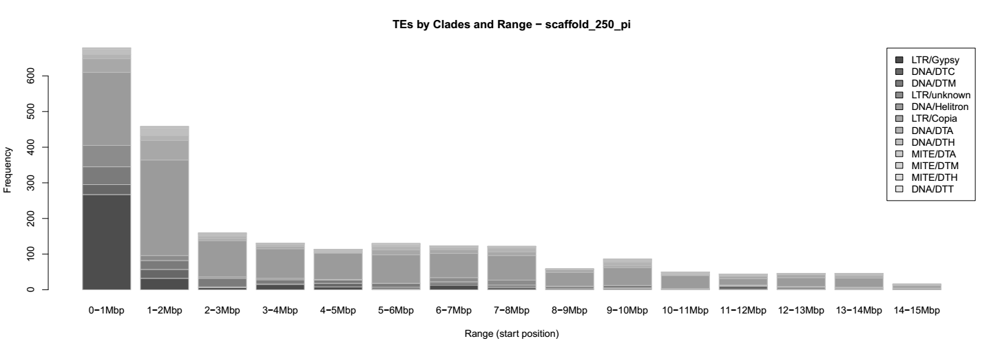
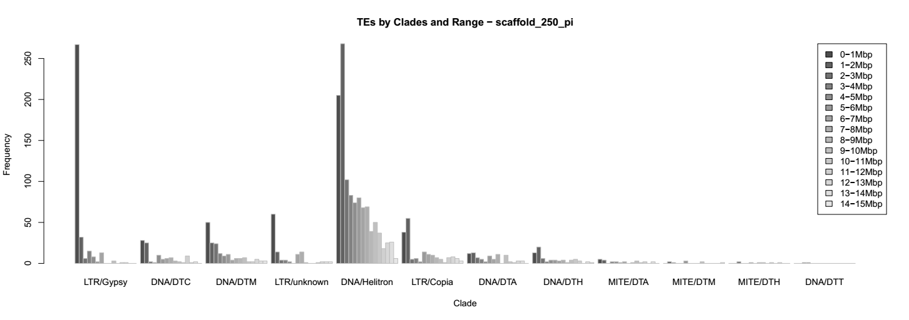

# Genome assembly of *A. thaliana* - questions of interest

## 1 - Read quality and statistics

### QC
1) What are the **read lengths** of the different datasets?

    **Illumina**: **101** [#Seq: 43'225'638]\
    ___Pacbio ERR3415825:  total 3'340'800'486, avg. 6'078 (50-46'330) [#Seq: 549'679] \
    ___Pacbio ERR3415826: total 4'101'029'001, avg. 7'094 (50-43'512) [#Seq: 578'098] \
    **Pacbio** overall: total 7'441'829'487, avg. **6'599** [#Seq: 1'127'777] \
    **RNAseq**: **101** [#Seq: 18'094'147]

2) What kind of **coverage** do you expect from the Pacbio and the Illumina WGS reads? (hint: lookup the expected genome size of Arabidopsis thaliana)

    cov = bp_seq / bp_tot = (#reads * read_length) / bp_tot \

    **Illumina**: cov = (43'225'638 * 101) / 130'000'000 = **33.6** \
    ___Pacbio ERR3415825: cov = 3'340'800'486 / 130'000'000 = 25.7 \
    ___Pacbio ERR3415826: cov = 4'101'029'001 / 130'000'000 = 32.5 \
    **Pacbio** mean: cov = **28.6** \
    (RNAseq: complex to estimate, since not whole genome is translated!)

3) Do all datasets have information on **base quality**?

    No, only Illumina and RNAseq (which is also Illumina), but not Pacbio

### GenomeScope
1) Is the estimated **genome size** expected?

    Illumina: 131'241'237bp --> yes, well in the range of known genome size \
    Pacbio: 31'720'177bp --> no! not hi-fi --> many errors --> same seq treated as seperate ones --> too many kmers

2) Is the percentage of **heterozygousity** expected?

    Illumina: 0.118% --> yes\
    Pacbio: 4.46% --> no! (see above for explanation)

3) Bonus: Why are we using **canonical k-mers**? (use Google)

    When counting k-mers in sequencing reads, there is no real way to differentiate between k-mers and their reverse complement: seeing e.g. ACGGT is equivalent to seeing ACCGT, since the latter is the reverse complement of the former and the sequenced reads don't originate from a prescribed strand of the DNA.\
    Using "cannonical k-mers" takes this into account: The -C command in jellyfish considers both a k-mer and its reverse complement as equivalent, and associates the count for both with the k-mer among the two that is lexicographically smaller. So, for example, above only ACCGT would be stored and its count would be equal to the number of occurrences of both ACCGT and ACGGT. If -C is not included, these k-mers will be treated separately. There's nothing "wrong" with this, per-se, but it may not be what you want. adapted from biostars

## 2 - Assembly

## 3 - Assembly polishing and evaluation
### Polishing
1) How much does the **polishing improve** your assemblies (run the assembly evaluations on the polished and non-polished assemblies)?

    Yes, especially canu profited. See below, notably fragmented and missing BUSCOs, as well as QUAST mismatches.

### BUSCO (fly vs. canu, original vs. polished; all no_ref)
1) How do your **genome assemblies** look according to your BUSCO results? Is one genome assembly better than the other?

    n = 4596 (for all analyses) BUSCOS:\
    C = Complete, S = Complete and single-copy, D = Complete and duplicated, F = Fragmented, M = Missing

    _ |C | orig. | pol. | S | orig. | pol. | D | orig. | pol. | F | orig. | pol. | M | orig. | pol. | 
    ---|---|---|---|---|---|---|---|---|---|---|---|---|---|---|---|
    **flye** | | 4532 | **4543** | | 4488 | **4499** | | 44 | **44** | | 5 | **3** | | 59 | **50** |
    **canu** | | 4485 | **4542** | | 4435 | **4496** | | 50 | **46** | | 22 | **6** | | 89 | **48** |

    

    **Conclusions**:
    - They both look overall very similar and good quality
    - Both profited from polishing, but canu a bit more in that 16 of the 22 fragmented and 41 of the 89 missing BUSCOs could be fixed

2) How does your **transcriptome assembly** look? Are there many duplicated genes? Can you explain the differences with the whole genome assemblies?

    n = 4596 (for all analyses) BUSCOS:
    
    _ | C = complete | S = Complete and single-copy | D = Complete and duplicated | F = Fragmented | M = Missing |
    ---|---|---|---|---|--- |
    Transcr. | 3064 | 876 | 2188 | 257 | 1275 |

    

    **Explanation**:
    The mRNAs are of course expected to be...
    - ... ***specific*** for the current expression
    - ... expected to be present in ***variable numbers*** of copies each
    - ... possibly present in ***different forms*** (splice variants etc.)

### QUAST (flye vs. canu, original vs. polished, no_ref vs. ref)
1) How do your genome assemblies look according to your **QUAST results**? Is one genome assembly better than the other?

    _| flye_original | flye_polished | canu_original | canu_polished
    --- | --- | --- | --- | ---
    **Genome statistics** ||||
    Genome fraction (%) | 88.377 | 88.372 | 88.598 | 88.622
    Duplication ratio | 1.023 | 1.024 | 1.045 | 1.045
    Largest alignment | 3834122 | 3834741 | 3832991 | 3834587
    Total aligned length | 108239445 | 108246962 | 110797293 | 110866378
    NGA50 | 480262 | 480676 | 437326 | 437577
    LGA50 | 55 | 55 | 55 | 55
    **Misassemblies** |||| 
    "# misassemblies" | 787 | 788 | 941 | 946
    Misassembled contigs length | 114854247 | 114882441 | 116478486 | 116470711
    **Mismatches** |||| 
    "# mismatches per 100 kbp" | 595.06 | 596.92 | 590.73 | 593.51
    "# indels per 100 kbp" | 154.72 | 138.13 | 176.11 | 138.83
    "# N's per 100 kbp" | 1 | 0.63 | 0 | 0
    **Statistics without reference** |||| 
    "# contigs" | 222 | 222 | 263 | 263
    Largest contig | 20507362 | 20511527 | 12973239 | 12979362
    Total length | 120302467 | 120317193 | 122829857 | 122866659
    Total length (>= 1000 bp) | 120481303 | 120496040 | 122829857 | 122866659
    Total length (>= 10000 bp) | 119843676 | 119858316 | 122729360 | 122766579
    Total length (>= 50000 bp) | 118328916 | 118345850 | 118623136 | 118673382

    

    **Observations**:
    - General alignment statistics are similar
    - NGA50 is better in flye (however, diff. is smaller in NGA75: 136'717 vs. 130'075)
    - Looking at N(G/A)x plots important to confirm that N(G/A)50 is not misleading
    - LGA50 is the same (however, LGA75 is slightly better in flye: 172 vs. 177)
    - Misassembly statistics are overall better with flye
    - Mismatches are very similar (in this regard, canu benefitted a lot from polishing)

    **Conclusions**:
    - **Contiguity**: better with **flye** (NGAx/LGAx)
    - **Completeness**: **similar**
    - **Correctness**: better with **flye** (misassemblies; but hard to tell if not biological reasons!)
    - **If I have to choose one, I would choose flye**

2) What additional information you get if you have a **reference** available?

    - NAx, NGAx, LGAx; e.g. NAx = Nx where aligned blocks are counted instead of contig lengths
    - Misassembly statistics
    - Unaligned statistics
    - Details about mismatches (such as #indels, indel length etc.)
    - Alignment statistics:
        - Genome fraction
        - Duplication ratio
        - Largest alignment
        - Total aligned length

### Merqury (fly vs. canu, original vs. polished; all no_ref)
1) What are the **consensus quality QV** and **error rate** values of your assemblies?

2) What is the estimated **completeness** of your assemblies?

    _ | QV | orig. | pol. | Error rate | orig. | pol. | Completeness (%) | orig. | pol.
    ---|---|---|---|---|---|---|---|---|---
    **flye** || 37.0907 | **40.8411** || 0.000195402 | **8.23926e-05** || 95.6976 | **95.9899**
    **canu** || 35.1611  | **42.6788** || 0.000304714 | **5.39661e-05** || 95.4351 | **96.0191**

3) How does your copy-number **spectra** look like? Do they confirm the expected coverage?

    The spectra all look very similar. Therefore, only "flye polished" is shown here:

    

    **Interpretation**:
    - 1 peak --> mostly homozygous (no heterozygous regions assembled seperately) --> good
    - Peak is at around 28-29 --> fits the expected coverage of 28.6 really well! --> good

4) Does one assembly perfom better than the other?

    **QV & error rate**: both **very good** (remember QV of 40 ~99.99%), canu even (slightly) better here!
    **Completeness**: ~equal, **high** level

## 4 - Comparing Genomes
### nucmer and mummer
1) What does the dotplot show and what do the different colors mean?

    It shows locations and directions of regions on the two compared genomes. Forward matches are shown in red, while reverse matches are shown in green. It shows regions of "synteny", i.e. when the order of genes is similar (on large scale).

2) Do your genome assemblies look very different from the reference genome?

    Yes and no. On first sight it looks kind of "messy", however one can see, that most dots do form a diagonal, or a diagonal could be formed if parts were shifted and/or reversed. Note that there are chromosomes that are split onto multiple contigs, but, importantly, (almost) no contigs that contain regions of multiple chromosomes. The latter would mean that there was probably a misassembly.

    **Flye vs. Reference**
    
    **Canu vs. Reference**
    

3) How different are the two genome assemblies compared to each other?

    The direct comparison shows that they are actually very similar!

    **Flye vs. Canu**
    

4) (If you assembled different accessions: Do you see any differences between the accessions?)

    I did not.

## 5 - TE annotation
1) Visualize the genomic distribution of different TE superfamilies and clades in the longest scaffolds.

    
    

2) Report the number of base pairs and the percent of the genome occupied by each superfamily and clade.
    
    From pilon_bt2_flye.fasta.mod.EDTA.TEanno.sum:

    **Repeat Classes**\
    Total Sequences: 375\
    Total Length: 120'535'670 bp
    Class            |  Count      |  bpMasked   |  %masked
    ---              |  ---        |  ---        |  ---
    **LTR**          |             |             |   
    Copia            |  1140       |  1296011    |  1.08% 
    Gypsy            |  5226       |  5563317    |  4.62% 
    unknown          |  1343       |  828282     |  0.69% 
    **TIR**          |             |             |   
    CACTA            |  1212       |  835242     |  0.69% 
    Mutator          |  1882       |  953181     |  0.79% 
    PIF_Harbinger    |  539        |  236517     |  0.20% 
    Tc1_Mariner      |  28         |  35059      |  0.03% 
    hAT              |  844        |  342012     |  0.28% 
    **nonTIR**       |             |             |   
    helitron         |  10562      |  5934607    |  4.92% 
    _________________|_____________|_____________|_______________
    **total interspersed**   | 22776   |        16024228   |     13.29%   |
    _________________|_____________|_____________|_______________
    **Total**   | 22776   |        16024228   |     13.29%   |

3) (Share the results and compare the clades abundance between Arabidopsis accessions.)
4) (Report the number of intact and fragmented copies for each TE clade. What might this suggest about their dynamics?)