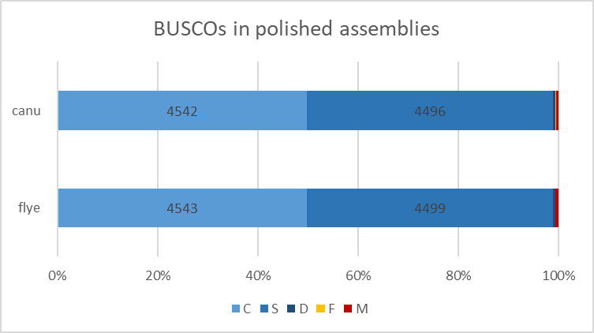
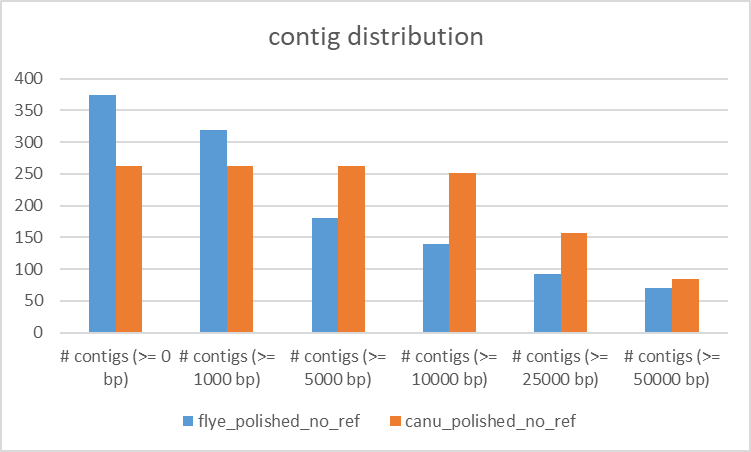
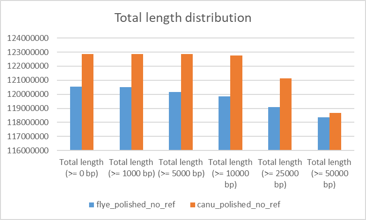

# Genome assembly of *A. thaliana* - questions of interest
## 1 - Read quality and statistics
### QC
1) What are the read lengths of the different datasets?

    Illumina: 101 [#Seq: 43'225'638]\
    Pacbio: 50-43'512 (ERR3415826) and 50-46'330 (ERR3415825) [#Seq: 578'098 and 549'679]\
    RNAseq: 101 [#Seq: 18'094'147]

2) What kind of coverage do you expect from the Pacbio and the Illumina WGS reads? (hint: lookup the expected genome size of Arabidopsis thaliana)

    cov = bp_seq / bp_tot = (#reads * read_length) / bp_tot \
    Illumina: cov = (43'225'638 * 101) / 130'000'000 = 33.6 \
    Pacbio: cov = (~550'000 * ~23'000) / 130'000'000 = 97.3

3) Do all datasets have information on base quality?

    No, only Illumina and RNAseq (which is also Illumina), but not Pacbio

### GenomeScope
1) Is the estimated genome size expected?

    Illumina: 131'241'237bp --> yes, well in the range of known genome size \
    Pacbio: 31'720'177bp --> no!

2) Is the percentage of heterozygousity expected?

    Illumina: 0.118% --> yes\
    Pacbio: 4.46% --> no!

3) Bonus: Why are we using canonical k-mers? (use Google)

    When counting k-mers in sequencing reads, there is no real way to differentiate between k-mers and their reverse complement: seeing e.g. ACGGT is equivalent to seeing ACCGT, since the latter is the reverse complement of the former and the sequenced reads don't originate from a prescribed strand of the DNA.\
    Using "cannonical k-mers" takes this into account: The -C command in jellyfish considers both a k-mer and its reverse complement as equivalent, and associates the count for both with the k-mer among the two that is lexicographically smaller. So, for example, above only ACCGT would be stored and its count would be equal to the number of occurrences of both ACCGT and ACGGT. If -C is not included, these k-mers will be treated separately. There's nothing "wrong" with this, per-se, but it may not be what you want. adapted from biostars

## 2 - Assembly

## 3 - Assembly polishing and evaluation
### Polishing
1) How much does the polishing improve your assemblies (run the assembly evaluations on the polished and non-polished assemblies)?

    See below, evaluation with BUSCO and with Merqury

### BUSCO (fly vs. canu, polished vs. original; all no_ref)
1) How do your **genome assemblies** look according to your BUSCO results? Is one genome assembly better than the other?

    n = 4596 (for all analyses) BUSCOS:\
    C = complete, S = Complete and single-copy, D = Complete and duplicated, F = Fragmented, M = Missing

    _ |C | orig. | pol. | S | orig. | pol. | D | orig. | pol. | F | orig. | pol. | M | orig. | pol. | 
    ---|---|---|---|---|---|---|---|---|---|---|---|---|---|---|---|
    flye | | 4532  | 4543 | | 4488 | 4499 | | 44  | 44  | | 5 | 3 | | 59 | 50 |
    canu | | 4485 | 4542 | | 4435 | 4496 | | 50 | 46 | | 22 | 6 | | 89 | 48 |

    

    **Conclusions**:
    - They both look overall very similar and good quality
    - Both profitted from polishing, but canu a bit more in that 16 of the 22 fragmented and 41 of the 89 missing BUSCOs could be fixed

2) How does your **transcriptome assembly** look? Are there many duplicated genes? Can you explain the differences with the whole genome assemblies?

    n = 4596 (for all analyses) BUSCOS:
    
    _ | C = complete | S = Complete and single-copy | D = Complete and duplicated | F = Fragmented | M = Missing |
    ---|---|---|---|---|--- |
    Transcr. | 3064 | 876 | 2188 | 257 | 1275 |

    **Explanation**:
    The mRNAs are of course expected to be...
    - ... specific for the current expression
    - ... expected to be present in high numbers of copies each
    - ... possibly present in different forms (splice variants etc.)

### QUAST (ref vs. no_ref, fly vs. canu; only polished)
1) How do your genome assemblies look according to your QUAST results? Is one genome assembly better than the other?

    The distribution of the contigs does not change and is as follows:

    
    

    Also the N- and L-values are the same for polished and original assemblies:

    _ | flye (ref = no-ref) | canu (ref = no-ref)
    --- | --- | ---
    N50	| 13006968 | 5793939
    NG50 | 6204915 | 5755049
    N75 | 2762381 | 1302541
    NG75 | 2432852 | 1107500
    L50 | 4 | 7
    LG50 | 5 | 8
    L75 | 11 | 18

    However, the NG- and LG-values differ:
    _ | flye_polished_no_ref | flye_polished_ref | canu_polished_no_ref | canu_polished_ref
    --- | --- | --- | --- | ---
    NG50 | 6204915 | 13006968 | FALSE | 5755049 | 5793939
    N75 | 2762381 | 2762381 | TRUE | 1302541 | 1302541
    NG75 | 2432852 | 2762381 | FALSE | 1107500 | 1528297
    L50 | 4 | 4 | TRUE | 7 | 7
    LG50 | 5 | 4 | FALSE | 8 | 7
    L75 | 11 | 11 | TRUE | 18 | 18
    LG75 | 14 | 11 | FALSE | 23 | 17

2) What additional information you get if you have a reference available?

    _ | flye (ref) | canu (ref)
    --- | --- | ---
    #misassemblies | 788 | 946
    #misassembled contigs | 81 | 145
    Misassembled contigs length | 114882441 | 116470711
    #local misassemblies | 4509 | 5008
    #unaligned mis. contigs | 36 | 30
    #unaligned contigs | 8 + 126 part | 8 + 168 part
    Unaligned length | 12078002 | 11990937
    Genome fraction (%) | 88.372 | 88.622
    Duplication ratio | 1.024 | 1.045
    #mismatches per 100 kbp | 596.92 | 593.51
    #indels per 100 kbp | 138.13 | 138.83
    Largest alignment | 3834741 | 3834587
    Total aligned length | 108246962 | 110866378
    NA50 | 455473 | 415384
    NGA50 | 480676 | 437577
    NA75 | 130140 | 106745
    NGA75 | 136717 | 130075
    LA50 | 56 | 58
    LGA50 | 55 | 55
    LA75 | 176 | 197
    LGA75 | 172 | 177

### Merqury (fly vs. canu, polished vs. original; all no_ref)
1) What are the consensus quality QV and error rate values of your assemblies?
2) What is the estimated completeness of your assemblies?
3) How does your copy-number spectra look like? Do they confirm the expected coverage?
4) Does one assembly perfom better than the other?

## 4 - Comparing Genomes
### nucmer and mummer
1) What does the dotplot show and what do the different colors mean?
2) Do your genome assemblies look very different from the reference genome?
3) How different are the two genome assemblies compared to each other?
4) (If you assembled different accessions: Do you see any differences between the accessions?)
